**Contact Information:** Caitlin J. Campbell ([caitjcampbell@gmail.com](caitjcampbell@gmail.com))


# Overview

The `isocat` package provides multiple tools for creating and quantitatively analyzing and summarizing probability-of-origin surfaces generated from stable isotope analyses of animal tissue. This vignette will walk users through a brief example for each function included in this vignette.


```r
library(isocat)
```

# Loading example data

`isocat` has example isoscape data included for a small extent of North America.

Example isoscape:


```r
myiso <- rasterFromXYZ(isoscape)
```

Load example isoscape standard deviation surface:


```r
myiso_sd <- rasterFromXYZ(isoscape_sd)
```

```r
library(ggplot2, quietly = T); library(rasterVis, quietly = T); library(gridExtra, quietly = T)
```

```
## 
## Attaching package: 'latticeExtra'
```

```
## The following object is masked from 'package:ggplot2':
## 
##     layer
```

```
## 
## Attaching package: 'gridExtra'
```

```
## The following object is masked from 'package:dplyr':
## 
##     combine
```

```r
gglayers <-  list(
  geom_tile(aes(fill = value)),
  coord_equal(),
  theme_bw(),
  scale_x_continuous(name = "Long", expand = c(0,0)),
  scale_y_continuous(name = "Lat", expand = c(0,0))
)
lab1 <- list(
  gglayers, 
  scale_fill_gradient(name = expression(paste(delta, "D (\u2030)")), low = 'grey10', high = 'grey90')
  )

gridExtra::grid.arrange( 
  gplot(myiso) + lab1 + ggtitle("Example Isoscape"), 
  gplot(myiso_sd) + lab1 + ggtitle("Standard Deviation"),
  ncol = 2
  )
```

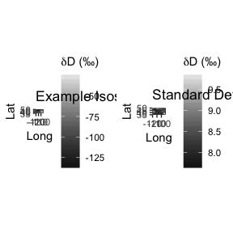<!-- -->

# Creating a probability-of-origin surface

To create a probability-of-origin map, we first import or generate a dataframe containing:

1) Individual IDs

2) Individual-level isotope data, transformed with a transfer function to reflect isoscape values.[^1]

3) Standard deviation of isotope standard measurements, which are associated with machine accuracy.

[^1]: [TODO]  


```r
n <- 6 # Number of example rasters
set.seed(1)
df <- data.frame(
  ID = LETTERS[1:n], 
  isotopeValue = sample(cellStats(myiso, "min"):cellStats(myiso, "max"), n, replace = T), 
  SD_indv = rep(5, n)
  )
kableExtra::kable(df)
```

<table>
 <thead>
  <tr>
   <th style="text-align:left;"> ID </th>
   <th style="text-align:right;"> isotopeValue </th>
   <th style="text-align:right;"> SD_indv </th>
  </tr>
 </thead>
<tbody>
  <tr>
   <td style="text-align:left;"> A </td>
   <td style="text-align:right;"> -106.98399 </td>
   <td style="text-align:right;"> 5 </td>
  </tr>
  <tr>
   <td style="text-align:left;"> B </td>
   <td style="text-align:right;"> -94.98399 </td>
   <td style="text-align:right;"> 5 </td>
  </tr>
  <tr>
   <td style="text-align:left;"> C </td>
   <td style="text-align:right;"> -72.98399 </td>
   <td style="text-align:right;"> 5 </td>
  </tr>
  <tr>
   <td style="text-align:left;"> D </td>
   <td style="text-align:right;"> -36.98399 </td>
   <td style="text-align:right;"> 5 </td>
  </tr>
  <tr>
   <td style="text-align:left;"> E </td>
   <td style="text-align:right;"> -113.98399 </td>
   <td style="text-align:right;"> 5 </td>
  </tr>
  <tr>
   <td style="text-align:left;"> F </td>
   <td style="text-align:right;"> -37.98399 </td>
   <td style="text-align:right;"> 5 </td>
  </tr>
</tbody>
</table>

The contents of these columns are passed to the function `isotopeAssignmentModel` as vectors, along with the object names of isoscape and isoscape-SD objects. If parallel processing is specified, the function creates and deploys clusters using the `doParallel` package. The output is a rasterStack with layers named corresponding to the individual IDs.


```r
assignmentModels <- isotopeAssignmentModel(
  ID = df$ID,
  isotopeValue = df$isotopeValue, 
  SD_indv = df$SD_indv, 
  precip_raster = myiso, 
  precip_SD_raster = myiso_sd, 
  nClusters = FALSE
  )

# Plot.
ggProb <- list(
  facet_wrap(~ variable),
  scale_fill_gradient(name = "Probability\nOf Origin", low = 'darkblue', high = 'yellow') 
  )

gplot(assignmentModels) + gglayers + ggProb
```

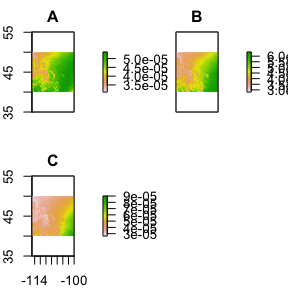<!-- -->

# Comparing surfaces

## Metric of surface similarity

To compare probability-of-origin surfaces, we apply Schoener's D metric. To simply compare two surfaces, we can apply `isocat`'s `schoenersD` function, which determine's Schoener's D-metric of similarity between two surfaces. The D-value varies between 0 (completely dissimilar surfaces) and 1 (identical surfaces).


```r
# Calculate Schoener's D-metric of spatial similarity between 
# two of the example probability surfaces.

schoenersD(assignmentModels[[1]], assignmentModels[[2]])
```

```
## [1] 0.5777822
```

To compare multiple surfaces to one another, `isocat` includes a `simmatrixMaker` function to create a similarity matrix of the surfaces. The output is a symmetric matrix with row and column names corresponding to the layernames of the surfaces to be compared. The `nClusters` specification, as in the `isotopeAssignmentModel` function, generates a number of parallel processing clusters equal to the numeric value specified. If `csvSavePath` is included, a .csv file will also be written to the path specified. For large rasterStacks, this function can be quite processing-intensive and take some time.


```r
mySimilarityMatrix <- simmatrixMaker(
  assignmentModels,
  nClusters = FALSE,
  csvSavePath = FALSE
)
mySimilarityMatrix
```

```
##              A           B          C            D            E
## A 1.0000000000 0.577782179 0.08876164 0.0003429836 0.7639950906
## B 0.5777821786 1.000000000 0.24369626 0.0032380107 0.3900655057
## C 0.0887616430 0.243696260 1.00000000 0.0836391997 0.0470433418
## D 0.0003429836 0.003238011 0.08363920 1.0000000000 0.0000866323
## E 0.7639950906 0.390065506 0.04704334 0.0000866323 1.0000000000
## F 0.0004037637 0.003695405 0.09175482 0.9662229136 0.0001058838
##              F
## A 0.0004037637
## B 0.0036954045
## C 0.0917548194
## D 0.9662229136
## E 0.0001058838
## F 1.0000000000
```
## Clustering by similar origins

To cluster individuals by similar origins, `isocat` relies on the titular function of the package `pvclust`. The input to this function is the simmilarity matrix (here, "simmatrix"). Distance measures and clustering methods are detailed in the `pvclust` package, so for more information on methods discussed here, see:


```r
help(pvclust)
```

### Clustering with bootstrapping

The default distance measure built into this function is correlational distance, and 'average' as a clustering method. The number of bootstrap replications default to 1000, and nClusters specifies how many clusters to enitiate for parallel processing through `doParallel`. The output of this is an object of class "pvclust".


```r
cS <- clusterSimmatrix(
  simmatrix = mySimilarityMatrix,
  dist_mthd = "correlation", 
  hclust_mthd = "average",
  nBoot = 1000,  
  nClusters = FALSE,
  r = seq(.7,1.4,by=.1)
  )
```

```
## Bootstrap (r = 0.67)... Done.
## Bootstrap (r = 0.67)... Done.
## Bootstrap (r = 0.83)... Done.
## Bootstrap (r = 1.0)... Done.
## Bootstrap (r = 1.0)... Done.
## Bootstrap (r = 1.17)... Done.
## Bootstrap (r = 1.17)... Done.
## Bootstrap (r = 1.33)... Done.
```

```r
plot(cS)
```

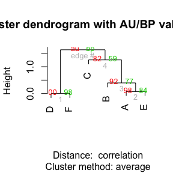<!-- -->

### Clustering without bootstrapping

If bootstrapped clustering is not desired, one could instead apply the `hclust` function from within the base `stats` package:


```r
hS <- hclust(dist(data.matrix(mySimilarityMatrix)))
plot(hS)
```

<!-- -->

Note that the output of the `pvclust` analysis also contains a nested object of class "hclust".

### Project Clusters

[TODO explanation of cluster cutting]
[TODO fix this garbage code below and explain it in English]


```r
myheight <- 0.05

plot(as.dendrogram(cS$hclust), horiz = F)
abline(h = myheight, col = "red", lwd = 2, lty = 2)
```

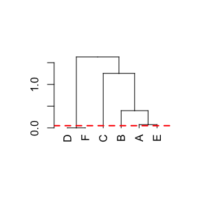<!-- -->

```r
df$cluster <- dendextend::cutree(cS$hclust, h = myheight)

kableExtra::kable(df)
```

<table>
 <thead>
  <tr>
   <th style="text-align:left;"> ID </th>
   <th style="text-align:right;"> isotopeValue </th>
   <th style="text-align:right;"> SD_indv </th>
   <th style="text-align:right;"> cluster </th>
  </tr>
 </thead>
<tbody>
  <tr>
   <td style="text-align:left;"> A </td>
   <td style="text-align:right;"> -106.98399 </td>
   <td style="text-align:right;"> 5 </td>
   <td style="text-align:right;"> 1 </td>
  </tr>
  <tr>
   <td style="text-align:left;"> B </td>
   <td style="text-align:right;"> -94.98399 </td>
   <td style="text-align:right;"> 5 </td>
   <td style="text-align:right;"> 2 </td>
  </tr>
  <tr>
   <td style="text-align:left;"> C </td>
   <td style="text-align:right;"> -72.98399 </td>
   <td style="text-align:right;"> 5 </td>
   <td style="text-align:right;"> 3 </td>
  </tr>
  <tr>
   <td style="text-align:left;"> D </td>
   <td style="text-align:right;"> -36.98399 </td>
   <td style="text-align:right;"> 5 </td>
   <td style="text-align:right;"> 4 </td>
  </tr>
  <tr>
   <td style="text-align:left;"> E </td>
   <td style="text-align:right;"> -113.98399 </td>
   <td style="text-align:right;"> 5 </td>
   <td style="text-align:right;"> 5 </td>
  </tr>
  <tr>
   <td style="text-align:left;"> F </td>
   <td style="text-align:right;"> -37.98399 </td>
   <td style="text-align:right;"> 5 </td>
   <td style="text-align:right;"> 4 </td>
  </tr>
</tbody>
</table>

#### Aggregate Surfaces

For each group of individuals of common origin, create an aggregate surface of mean within-group probability of origin using the `meanAggregateClusterProbability` function. This function returns a RasterStack corresponding to each cluster fed into it. If specified as an integer, `nClust` parameter interfaces with `raster::clusterR` to create and apply apply $n$ multi-core clusters for faster processing.


```r
meanSurfaces <- meanAggregateClusterProbability( 
  indivIDs = df$ID, 
  clusters = df$cluster, 
  surfaces = assignmentModels, 
  nClust = FALSE 
  )

gplot(meanSurfaces) + gglayers + ggProb
```

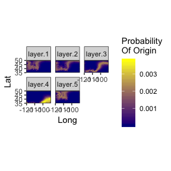<!-- -->

#### Summary Surface

[TODO] write this


```r
summaryMap <- projectSummaryMaxSurface(surfaces = meanSurfaces, nClust = FALSE)

gplot(summaryMap) + 
  gglayers +
  scale_fill_viridis_c(name = "Cluster")
```

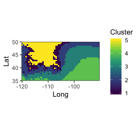<!-- -->

# Post-processing surfaces

Once probability-of-origin models are created, several *post-hoc* approaches exist to relativize and/or summarize individual origins by transforming the probabilities of each probabability-of-origin surface. Here, we explore four approaches, termed:

- Cumulative Sum

- Odds-Ratio

- Quantile

- Quantile-Simulation

The relative strengths and performance of these approaches are explored in Campbell et al.'s "Refining assessment of the geographic origins of animals inferred from stable isotope data" (in prep).

We will use an example probability surface in the following example. Let us also specify a sampling site at point $i,j$, indicated with a red circle.


```r
set.seed(42)
p <- isotopeAssignmentModel(
  ID = "Example",
  isotopeValue = sample(-125:-25, 1), 
  SD_indv = 5, 
  precip_raster = myiso, 
  precip_SD_raster = myiso_sd, 
  nClusters = FALSE
  )[[1]]

# Example Point
pt <- data.frame(x = -100, y = 40)
ptDeets <- list(
  geom_point(
    data = pt, 
    col = "red", shape = 1, size = 2,
    aes(x = x, y = y)
    )
)

ex_plot <- gplot(p) + gglayers + ggProb + ptDeets

ex_hist <- data.frame(x = p[]) %>% 
  ggplot(.) +
  geom_density(aes(x = x)) +
  scale_y_continuous(expand = c(0,0)) +
  scale_x_continuous(name = "Probability Value") +
  theme_bw() +
  geom_vline(aes(xintercept = extract(p, pt)), linetype = "dashed", col = "red")

gridExtra::grid.arrange(ex_plot, ex_hist, ncol = 2, widths = c(2,1)) 
```

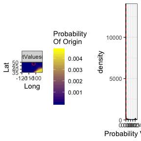<!-- -->

## Cumulative Sum


```r
CumSumEx <- makecumsumSurface(p)
```


```r
cumsum_plot <- gplot(CumSumEx) + 
  gglayers + ptDeets +
  scale_fill_gradient(
    name = "Cumulative Sum\nProbability\nOf Origin", low = 'darkblue', high = 'yellow') 

cumsum_hist <- data.frame(x = CumSumEx[]) %>% 
  ggplot(.) +
  geom_density(aes(x = x)) +
  scale_y_continuous(expand = c(0,0)) +
  scale_x_continuous(name = "Cumulative Sum\nProbability Value") +
  theme_bw() +
  geom_vline(aes(xintercept = extract(CumSumEx, pt)), linetype = "dashed", col = "red")

gridExtra::grid.arrange( cumsum_plot, cumsum_hist, ncol = 2, widths = c(2,1) ) 
```

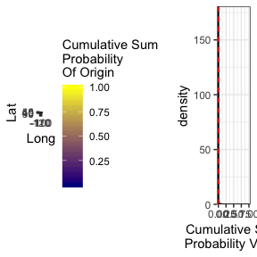<!-- -->


## Odds-Ratio


```r
OddsRatioEx <- makeOddsSurfaces(p)
```


```r
odds_plot <- gplot(OddsRatioEx) + 
  gglayers + ptDeets +
  scale_fill_gradient(
    name = "Odds-Ratio\nProbability\nOf Origin", low = 'darkblue', high = 'yellow') 

odds_hist <- data.frame(x = OddsRatioEx[]) %>% 
  ggplot(.) +
  geom_density(aes(x = x)) +
  scale_y_continuous(expand = c(0,0)) +
  scale_x_continuous(name = "Odds Ratio Value") +
  theme_bw() +
  geom_vline(aes(xintercept = extract(OddsRatioEx, pt)), linetype = "dashed", col = "red")

gridExtra::grid.arrange( odds_plot, odds_hist, ncol = 2, widths = c(2,1) ) 
```

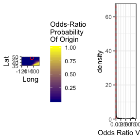<!-- -->


## Quantile


```r
QuantileEx <- makeQuantileSurfaces(p)
```


```r
quantile_plot <- gplot(QuantileEx) + 
  gglayers + ptDeets +
  scale_fill_gradient(
    name = "Quantile\nProbability\nOf Origin", low = 'darkblue', high = 'yellow') 

quantile_hist <- data.frame(x = QuantileEx[]) %>% 
  ggplot(.) +
  geom_density(aes(x = x)) +
  scale_y_continuous(expand = c(0,0)) +
  scale_x_continuous(name = "Quantile Value") +
  theme_bw() +
  geom_vline(aes(xintercept = extract(QuantileEx, pt)), linetype = "dashed", col = "red")

gridExtra::grid.arrange( quantile_plot, quantile_hist, ncol = 2, widths = c(2,1) ) 
```

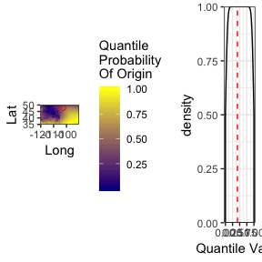<!-- -->


## Quantile-Simulation

Simulate a distribution fit to known-origin quantile values:

```r
q <- rweibull(20000, 6, .98)
q <- sample( q[ q >=0 & q <= 1 ], 10000, replace = T)
hist(q)
```

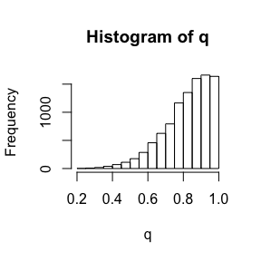<!-- -->

Create quantile-simulation surface:


```r
QuantSimEx <- makeQuantileSimulationSurface(
  probabilitySurface = p, 
  ValidationQuantiles = q,
  rename = FALSE, rescale = TRUE
  )
```


```r
quantsim_plot <- gplot(QuantSimEx) + 
  gglayers + ptDeets +
  scale_fill_gradient(
    name = "Quantile-Simulation\nProbability\nOf Origin", low = 'darkblue', high = 'yellow') 

quantsim_hist <- data.frame(x = QuantSimEx[]) %>% 
  ggplot(.) +
  geom_density(aes(x = x)) +
  scale_y_continuous(expand = c(0,0)) +
  scale_x_continuous(name = "Quantile-Simulation Value") +
  theme_bw() +
  geom_vline(aes(xintercept = extract(QuantSimEx, pt)), linetype = "dashed", col = "red")

gridExtra::grid.arrange( quantsim_plot, quantsim_hist, ncol = 2, widths = c(2,1) ) 
```

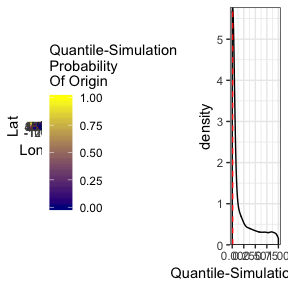<!-- -->

