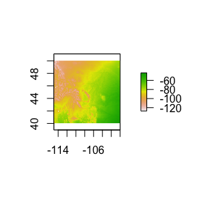

**Contact Information:** Caitlin Campbell ([caitjcampbell@gmail.com](caitjcampbell@gmail.com))


# Overview

The `isocat` package adds multiple tools for creating and quantitatively analyzing and summarizing probability-of-origin surfaces generated from stable isotope analyses of animal tissue. This vignette will walk users through a brief example for each function included in this vignette.


```r
library(isocat)
```

# Loading example data

`isocat` has example isoscape data included for a small extent of North America.

Example isoscape:


```r
data(isoscape)
myiso <- rasterFromXYZ(isoscape)
raster::plot(myiso)
```

<!-- -->

Example isoscape standard deviation surface:


```r
myiso_sd <- rasterFromXYZ(isoscape_sd)
```

# Creating a probability-of-origin surface

To create a probability-of-origin map, we first import or generate a dataframe containing:

1) Individual IDs

2) Individual-level isotope data, transformed with a transfer function to reflect isoscape values.[^1]

3) Standard deviation of isotope standard measurements, which are associated with machine accuracy.

[^1]: [TODO]  


```r
df <- data.frame(ID = LETTERS[1:3], dD = c(-100, -80, -50), SD_indv = rep(5, 3))
kable(df)
```

<table>
 <thead>
  <tr>
   <th style="text-align:left;"> ID </th>
   <th style="text-align:right;"> dD </th>
   <th style="text-align:right;"> SD_indv </th>
  </tr>
 </thead>
<tbody>
  <tr>
   <td style="text-align:left;"> A </td>
   <td style="text-align:right;"> -100 </td>
   <td style="text-align:right;"> 5 </td>
  </tr>
  <tr>
   <td style="text-align:left;"> B </td>
   <td style="text-align:right;"> -80 </td>
   <td style="text-align:right;"> 5 </td>
  </tr>
  <tr>
   <td style="text-align:left;"> C </td>
   <td style="text-align:right;"> -50 </td>
   <td style="text-align:right;"> 5 </td>
  </tr>
</tbody>
</table>

The contents of these columns are passed to the function `isotopeAssignmentModel` as vectors, along with the object names of isoscape and isoscape-SD objects. If parallel processing is specified, the function creates and deploys clusters using the `doParallel` package. The output is a rasterStack with layers named corresponding to the individual IDs.


```r
assignmentModels <- isotopeAssignmentModel(
  ID = df$ID, 
  dD = df$dD, 
  SD_indv = df$SD_indv, 
  precip_raster = myiso, 
  precip_SD_raster = myiso_sd, 
  nClusters = FALSE
  )
raster::plot(assignmentModels)
```

<!-- -->

# Comparing surfaces

To compare probability-of-origin surfaces, we apply Schoener's D metric. To simply compare two surfaces, we can apply `isocat`'s `schoenersD` function, which determine's Schoener's D-metric of similarity between two surfaces. The D-value varies between 0 (completely dissimilar surfaces) and 1 (identical surfaces).


```r
# Calculate Schoener's D-metric of spatial similarity between two of the example probability surfaces.
schoenersD(assignmentModels[[1]], assignmentModels[[2]])
#> [1] 0.969156
```

To compare multiple surfaces to one another, `isocat` includes a `simmatrixMaker` function to create a similarity matrix of the surfaces. The output is a symmetric matrix with row and column names corresponding to the layernames of the surfaces to be compared. The `nClusters` specification, as in the `isotopeAssignmentModel` function, generates a number of parallel processing clusters equal to the numeric value specified. If `csvSavePath` is included, a .csv file will also be written to the path specified. For large rasterStacks, this function can be quite processing-intensive and take some time.


```r
simmatrixMaker(
  assignmentModels,
  nClusters = FALSE,
  csvSavePath = FALSE
)
#>           A         B         C
#> A 1.0000000 0.9691560 0.9419794
#> B 0.9691560 1.0000000 0.9726951
#> C 0.9419794 0.9726951 1.0000000
```
# Clustering

To cluster individuals by similar origins, 

# Post-processing surfaces

